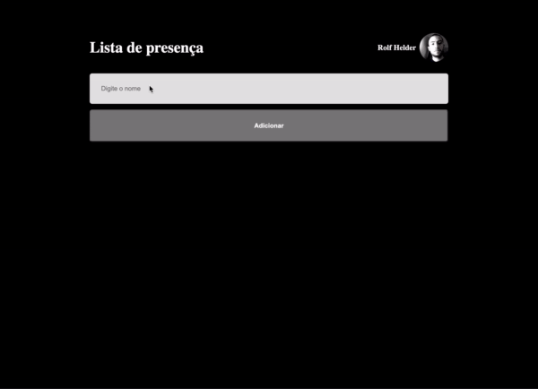

<h1>Presence List</h1> 

  
  

  <a href="#project">Project</a>&nbsp;&nbsp;|&nbsp;&nbsp;
  <a href="#technologies">Technologies</a>&nbsp;&nbsp;|&nbsp;&nbsp;
  <a href="#license">License</a>

<h2 id="project">💻 Project</h2>

This repo creates a presence list web application.

The user types a name in an input element and click a submit button. The name, hour and date gets recorded in a card underneath the form.

This is an exercise to practice both react and typescript skills.

It was made as part of Rocketseat's bootcamp.

<h2 id="technologies">🧪 Technologies</h2>

Project developed using the following technologies:

<ul>
    <li>React</li>
    <li>Typescript</li>
    <li>NodeJS</li>    
</ul>

<h2 id="license">📝 License</h2>

This project uses MIT license. See <a href="https://en.wikipedia.org/wiki/MIT_License">LICENSE</a> for more details.
 

<footer align="center">Made without ☕ by Rolf Helder</footer>
